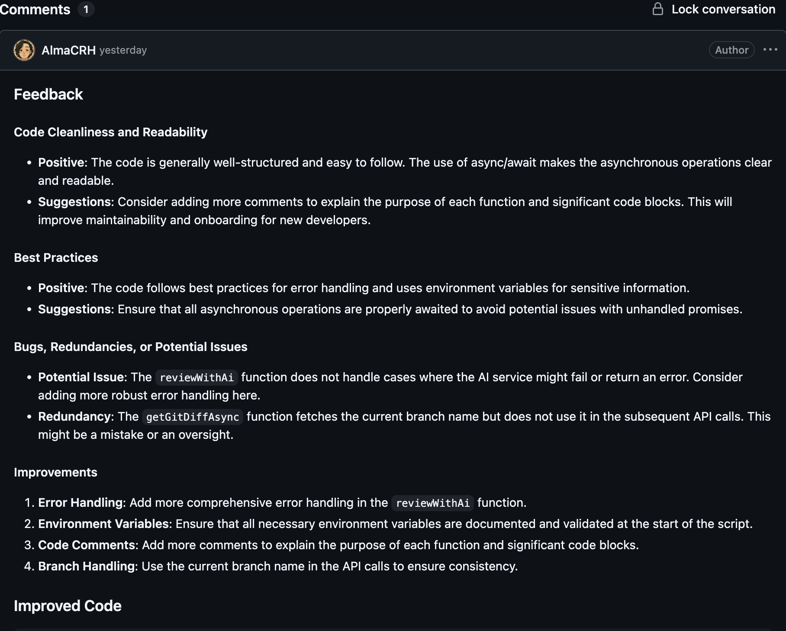

# MansheAI-Action
## 🧠 What’s MansheAI?

**MansheAI** is an AI-powered code review bot that analyzes the files you commit. It extracts the `diff`, compares it with the original code, and provides suggestions to improve your code quality, detect possible bugs, and follow best practices.

It leaves feedback as a comment directly on your commit — all powered by [Codestral](https://mistral.ai/news/codestral/), a state-of-the-art AI model for code.

---

## 🔧 How to use it

1. **Create a workflow file** in your repository under `.github/workflows/`, for example:

`.github/workflows/mansheai.yml`

```yaml
name: MansheAI Review

on:
  pull_request:
    branches:
      - main # You can change this to the branch or branches you want to target

jobs:
  review:
    runs-on: ubuntu-latest

    steps:
      - name: Checkout code
        uses: actions/checkout@v2

      - name: Run MansheAI
        uses: AlmaCRH/mansheai-action@v1
        with:
          github_token: ${{ secrets.GITHUB_TOKEN }}
          ai_key: ${{ secrets.CODESTRAL_KEY }}
```

## ⚙️ Setting up the secrets
•	Go to your repository Settings → Secrets and variables → Actions → New repository secret
•	Add your Codestral API key with the name:
```bash
CODESTRAL_KEY
```
> [!NOTE]
> You don’t need to manually add GITHUB_TOKEN — GitHub provides it automatically and securely in workflows.

## 📝 What does it review?	
•	Clean code and readability
•	Adherence to best practices <br/>
•	Potential bugs or logic issues <br/>
•	Suggestions for refactoring or improvements <br/>
•	It even provides an improved version of the file (when relevant) <br/>

## 💡 Example
MansheAI will leave a comment like this:


## 🦾 Powered by
### Mistral Codestral
This action uses Mistral [Codestral](https://mistral.ai/news/codestral/), an advanced AI model specialized in code understanding and generation. It’s capable of reviewing your diffs and suggesting high-level improvements just like a CTO would.

### GitHub Actions
Built with GitHub Actions, MansheAI seamlessly integrates into your workflow. It runs automatically on every push and helps you maintain a high-quality code.

## 📄 License
This GitHub Action is open-sourced under the MIT License.
Feel free to use, modify, and distribute it as long as you include the original license and copyright.
